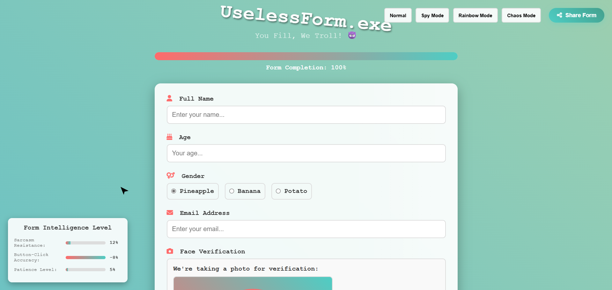

UselessForm.exe 🎯
Basic Details
Team Name: The Scroll Trolls

Team Lead: Irine Milton  “Mic Destroyer”  – Christ College Of Engineering irinjalakuda

Project Description:

UselessForm.exe is the most pointlessly brilliant web form you’ll ever (try to) fill. It refuses to scroll unless you make noise into your microphone. Loud noises = more scrolling. Silence = eternal stuckness.

But that’s not all — this isn’t your regular form. It’s a trolling masterpiece. The questions are endless, bizarre, and slightly annoying. Just when you think you’ve reached the end… surprise, there’s more. Each reload takes you back to the very top, making progress feel like a myth.

In short: It’s a form designed to waste your time, test your vocal cords, and make judges laugh at the sheer absurdity of it all.
  

The Problem (that doesn't exist):
People have it too easy scrolling with their mouse, trackpad, or finger. Where’s the challenge? Where’s the drama?

The Solution (that nobody asked for):
We removed normal scrolling entirely and replaced it with Shout-to-Scroll™. Want to fill the form? Better start yelling, clapping, or making goat noises Also get trolled by your own form to fill.

Technical Details
For Software:
Languages used: HTML, CSS, JavaScript

Frameworks used: None (pure chaos)

Libraries used: Web Audio API (for mic input), DOM APIs

Tools used: VS Code, GitHub Pages

For Hardware:
Main components: A microphone (built-in or external)

Specifications: Any mic that picks up human rage levels

Tools required: A working throat, optional megaphone

Implementation
Installation:

bash
Copy
Edit
git clone https://github.com/username/UselessForm.exe
Run:
Just open index.html in a browser (with HTTPS and mic permissions).

Project Documentation
Screenshots:

Shout-to-Scroll™ in action.
Infinite Terms & Conditions — for your reading pleasure.

Diagram:
User yells → Mic detects sound → Page scrolls → User regrets life choices.

Project Demo
Video: [Demo Link] Watch as we scream our way to the bottom.

Team Contributions
 Core JavaScript + Scroll logic , UI/UX chaos design , Fake fields + trolling features  All by IRINE MILTON ❤️

Made with ❤️ and questionable life choices at TinkerHub Useless Projects